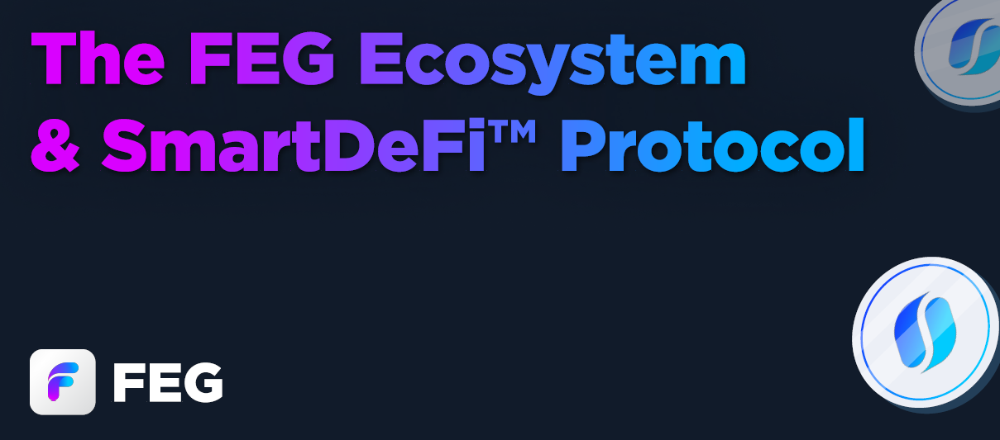

# 💡 Introducción

<figure><figcaption></figcaption></figure>

### 🌍 Acerca de [FEG.io](https://fegtoken.com/)&#x20;

FEG es un proyecto DeFi dedicado que presenta una plataforma de lanzamiento de tokens de próxima generación, "SmartDeFi", que ha pasado por rigurosas [audits](welcome/security-audits.md). Actualmente, estamos desplegados en las blockchains ETH, BNB y BASE con planes de expandir nuestra presencia a múltiples otras cadenas compatibles con EVM, ampliando aún más el alcance y las capacidades de nuestro ecosistema.

### 🌉 Desarrollo de Protocolo Cross-Chain

FEG ha desarrollado un protocolo cross-chain que permite que **un suministro único de tokens** fluya sin problemas a través de múltiples blockchains. Esta tecnología de vanguardia es única en DeFi y ha pasado por exhaustivas auditorías para garantizar su robustez y seguridad.

### 💼 Plataforma de Lanzamiento de Token SmartDeFi

Nuestra plataforma de lanzamiento de tokens está diseñada con características robustas para apoyar estrategias de inversión innovadoras:

* Respaldo Multi-Activos: Los inversores pueden respaldar tokens con múltiples activos como ETH, USDC y más.
* Redención y préstamos flexibles: Los tokens pueden ser quemados por su valor de respaldo de activos si es competitivo con los precios de mercado, o los inversores pueden optar por un préstamo sin intereses de 30 días contra sus tokens.
* Tokenomics Adaptativos: Los proyectos pueden modificar sus estructuras tokenómicas para alinearse mejor con los objetivos en evolución del proyecto o las estrategias de los inversores, sujeto a un retraso de seguridad de 3 días para los cambios.
* Integración de Tecnología RFI: Hemos mejorado la integración de la tecnología RFI (reflect finance), ofreciendo opciones para configuraciones RFI vs. No-RFI para mejorar la funcionalidad y los resultados de inversión.
* Desplegador de Protocolo de Staking: Utiliza nuestro Protocolo de Staking personalizable y totalmente auditado para aportar utilidad inmediata y valor mejorado a tu proyecto.
* Preventas sin Tokens: Un método de preventa pionero donde los inversores contribuyen a la liquidez y reciben un valor equivalente en dólares en tokens, mantenidos por el contrato. Al retirar su inversión, recuperan su nuevo valor en ETH o BNB, y los tokens correspondientes son quemados en la cartera muerta, preservando así el precio de mercado y mejorando la seguridad de la preventa. Durante este período, los inversores también ganan tarifas de proveedor de liquidez DEX.

### 🏛 Tokenización de Activos del Mundo Real

Nuestra plataforma de lanzamiento ahora admite la tokenización de activos del mundo real, permitiendo repartos de dividendos sin problemas a través de nuestro protocolo de staking auditado. Esta característica permite una conexión más profunda entre los activos digitales y físicos, ampliando el alcance y la utilidad de la tecnología blockchain.

### 📱 Aplicación FEGtrack

FEG también ha desarrollado la aplicación FEGtrack, que proporciona datos del proyecto, gráficos, información del mercado y actualizaciones de noticias. Está disponible para descargar tanto en dispositivos Android como iOS. Simplemente busca "FEGtrack" en tu tienda de aplicaciones preferida.&#x20;

### 🔗 Plataforma de Trading/Graficación SmartDeFi

Explora nuestro sitio personalizado de trading y graficación, donde todos los tokens de nuestra plataforma de lanzamiento serán negociables. Esta plataforma se enruta a través de UniSwap y PancakeSwap e incluye todas las herramientas de nuestro socio colaborador, TradingView. Visítanos en [SmartDeFi.com](https://smartdefi.com) !

### El Ecosistema

<table data-view="cards" data-full-width="false"><thead><tr><th></th><th></th><th></th><th data-hidden data-card-cover data-type="files"></th><th data-hidden data-card-target data-type="content-ref"></th></tr></thead><tbody><tr><td><strong>Token FEG</strong></td><td><em>Token nativo del ecosistema</em></td><td><a href="feg-smartdefi-tm/about-feg-token/">Leer más</a></td><td><a href=".gitbook/assets/FEG smaller.png">FEG smaller.png</a></td><td><a href="feg-smartdefi-tm/about-feg-token/">sobre-token-feg</a></td></tr><tr><td><strong>Gráficos SmartDeFi &#x26; Swap</strong></td><td><em>Comercia y visualiza datos de tokens</em></td><td>Leer más</td><td><a href=".gitbook/assets/FEGex smaller.png">FEGex smaller.png</a></td><td><a href="https://smartdefi.com">https://smartdefi.com</a></td></tr><tr><td><strong>Lanzador de SmartDeFi</strong></td><td><em>Crea tu propio proyecto gratuitamente</em></td><td><a href="smartdefi-tm-platform/smartdefi-protocol/">Leer más</a></td><td><a href=".gitbook/assets/Deployer smaller.png">Deployer smaller.png</a></td><td><a href="smartdefi-tm-platform/smartdefi-protocol/">protocolo-smartdefi</a></td></tr><tr><td><strong>Cartera Grafene 2FA</strong></td><td><em>Cartera caliente segura y fortalecida</em></td><td><a href="grafene/grafene.md">Leer más</a></td><td><a href=".gitbook/assets/Grafene smaller.png">Grafene smaller.png</a></td><td><a href="grafene/grafene.md">grafene.md</a></td></tr><tr><td><strong>FTW Desde la Cartera</strong></td><td><em>Órdenes de límite P2P trading</em></td><td><a href="broken-reference">Leer más</a></td><td><a href=".gitbook/assets/FTW smaller.png">FTW smaller.png</a></td><td><a href="broken-reference">Enlace roto</a></td></tr><tr><td><strong>Trading de Agregador</strong></td><td><em>Encuentra los mejores precios de comercio</em></td><td><a href="aggregator/aggregator-info.md">Leer más</a></td><td><a href=".gitbook/assets/Aggregator smaller.png">Aggregator smaller.png</a></td><td><a href="aggregator/aggregator-info.md">info-agregador.md</a></td></tr></tbody></table>

### Redes Sociales

<table data-view="cards"><thead><tr><th></th><th data-hidden></th><th data-hidden></th><th data-hidden data-card-target data-type="content-ref"></th></tr></thead><tbody><tr><td><strong>Telegram</strong></td><td></td><td></td><td><a href="https://t.me/FEGchat"> https://t.me/FEGchat</a></td></tr><tr><td>Twitter</td><td></td><td></td><td><a href="https://twitter.com/FEGtoken"> https://twitter.com/FEGtoken</a></td></tr><tr><td>Youtube</td><td></td><td></td><td><a href="https://www.youtube.com/@FEGOfficial">https://www.youtube.com/@FEGOfficial </a></td></tr><tr><td>Discord</td><td></td><td></td><td><a href="https://discord.fegtoken.com">https://discord.fegtoken.com</a></td></tr><tr><td>Instagram</td><td></td><td></td><td><a href="https://www.instagram.com/feg_token/">https://www.instagram.com/feg_token/ </a></td></tr><tr><td>Facebook</td><td></td><td></td><td><a href="https://www.facebook.com/FEGTokenOfficial/">https://www.facebook.com/FEGTokenOfficial/ </a></td></tr><tr><td>Medium</td><td></td><td></td><td><a href="https://fegtoken.medium.com">https://fegtoken.medium.com</a></td></tr><tr><td>Reddit</td><td></td><td></td><td></td></tr><tr><td>Soporte de Telegram</td><td></td><td></td><td><a href="https://support.fegtoken.com">https://support.fegtoken.com</a></td></tr></tbody></table>

### Otra Información

Sitio web principal: [https://feg.io/](https://feg.io/)\
Plataforma de trading: [https://smartdefi.com](https://smartdefi.com)\
Soporte en vivo: [https://livesupport.fegtoken.com](https://livesupport.fegtoken.com)

Correos de contacto\
[info@feg.io](mailto:info@feg.io)\
[marketing@feg.io](mailto:marketing@feg.io)