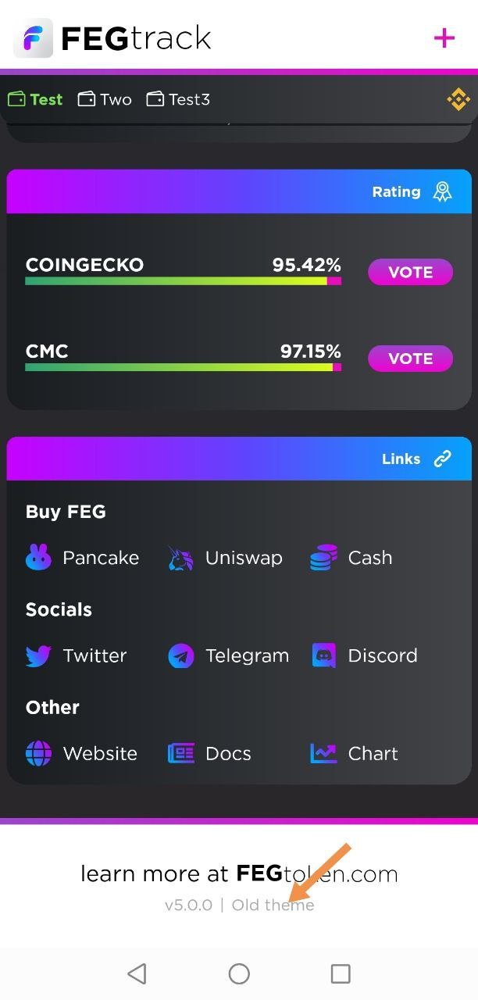
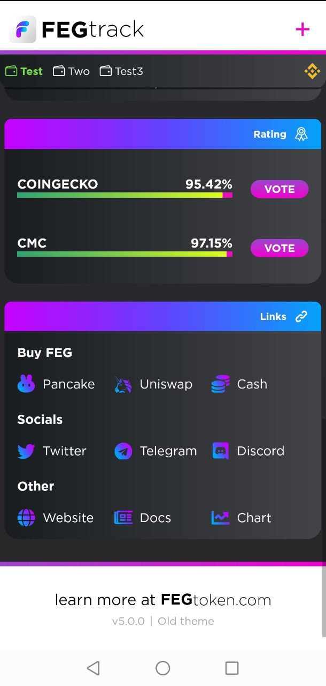
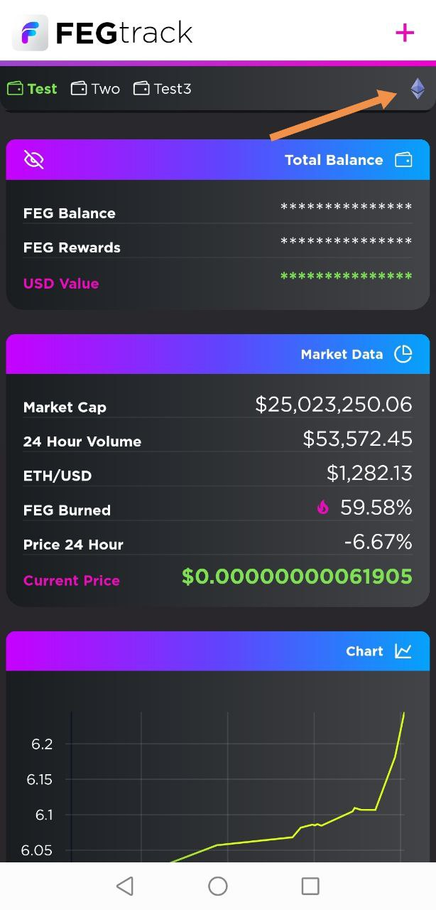
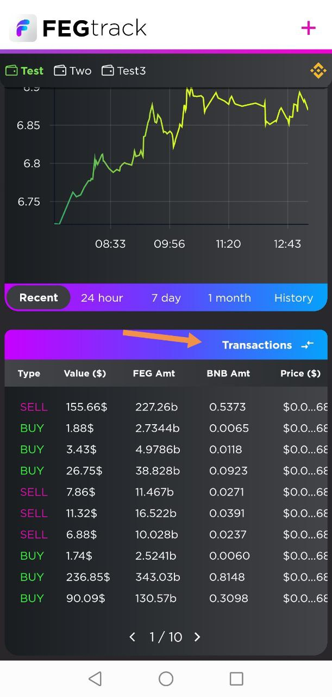

# 📲 Interfaz de FEGtrack


La información en esta página está obsoleta; se seguirán actualizaciones


## 1. Alterna entre los temas Antiguo y Nuevo

<figure><figcaption></figcaption></figure>

Puedes alternar entre dos temas si haces clic en el tema Antiguo en la parte inferior de la aplicación.

## 2. El menú se movió a la parte inferior

<figure><figcaption></figcaption></figure>

Puedes encontrar enlaces directos en la parte inferior de la aplicación para votar en Coinmarketcap y Coingeco. Más abajo, puedes encontrar enlaces directos para comprar FEGtoken desde plataformas como Uniswap, PancakeSwap o Fiat.\
\
Al desplazarte hacia abajo en la página, encontrarás enlaces a las diversas redes sociales mantenidas por el proyecto FEGtoken. Por último, encontrarás la versión de la aplicación que tienes instalada.

## 3. Añade tu(s) cartera(s)

<figure><figcaption></figcaption></figure>

FEGtrack es seguro; NO se conecta a tu cartera; simplemente lee la información de los holdings desde tu dirección pública de cartera, que es 0x...

Cualquiera en la blockchain puede ver direcciones públicas de cartera.\
\
\- Haz clic en el signo + y copia/pega la dirección pública de tu cartera en el campo "dirección de la cartera".\
\- Luego, le darás un nombre a tu cartera.\
\- Este nombre aparecerá en la parte superior de la aplicación una vez guardado.\
\
También puedes añadir la dirección de tu cartera escaneando el código QR en su interior.\
\
Una vez hecho esto, haz clic en el botón Guardar Cartera para salvar tu cartera dentro de FEGtrack.

## 4. Cambia la Red

<figure><figcaption></figcaption></figure>

Cerca de la parte superior de la pantalla, hay un ícono de red que te permite cambiar tu cartera entre las redes de Ethereum y Binance Smart Chain. \
\
Asegúrate de elegir la red correcta para los tokens FEG que posees. De lo contrario, tu saldo puede indicar cero; no te asustes si lo hace; cambia la red.

## &#x20;5. Cambia entre saldos

<figure><figcaption></figcaption></figure>

Haciendo clic repetidamente en el botón "Saldo total" alternará tu panel y te mostrará los diversos saldos que posees.\
\
El texto del botón y las estadísticas del panel cambiarán de la siguiente manera:\
1\. Total  /  2. Cartera  /  3. Stake v2  /  4. Stake v1

## 6. Datos del mercado

<figure><figcaption></figcaption></figure>

Desplázate hacia abajo y encontrarás la sección "datos del mercado", donde se te presentarán estadísticas de capitalización bursátil, volumen, precio, cantidades quemadas y circulación.\
\
Si presionas en las secciones 2, 3, 4 y 6, cambiarán para mostrar más datos (por ejemplo, FEG quemado cambiará a % de FEG en circulación).\
\
¡Pruébalo!

## 7. Transacciones&#x20;

<figure><figcaption></figcaption></figure>

Más abajo en la aplicación, te encontrarás con la sección "transacciones", donde verás una lista en vivo y desplazable horizontalmente de las transacciones de compra y venta más recientes de FEGtoken.\
\
Si presionas en "Transacciones", cambiará a "Mis transacciones". Puede tardar un tiempo en cargarse y mostrará tus transacciones con el token FEG. No mostrará transferencias, solo compras y ventas. \

## 8. Cambia el Tamaño de Fuente

<figure><figcaption></figcaption></figure>

Si presionas el logo de FEGtrack en la parte superior durante unos segundos, la aplicación cambiará a una fuente más grande para aquellos que tienen pantallas más pequeñas. Puedes volver al tamaño de fuente predeterminado presionando el logo nuevamente.

## 9. Ocultar Saldo

<figure><figcaption></figcaption></figure>

Puedes ocultar tu Saldo si haces clic en el ícono de la izquierda que parece un ojo. Los datos del mercado y las transacciones seguirán mostrándose.