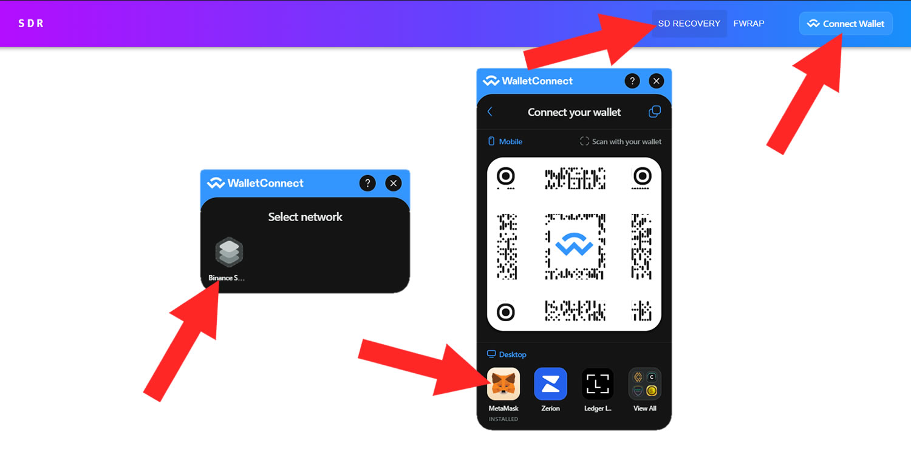
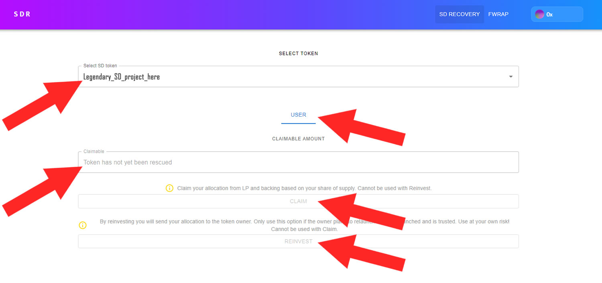

# 👩‍🏫 SDR para Inversores

### #1 Conecta tu billetera a la herramienta SDR

Asegúrate de estar en la pestaña "SD RECOVERY" en la parte superior, como se muestra en la imagen de ejemplo.\
\
Luego, haz clic en "Connect Wallet", selecciona la red en la que se emitieron tus antiguos tokens SD (BSC o ETH), y luego procede con los pasos necesarios para completar la conexión de la billetera.\
\
Ten en cuenta que estos pasos pueden variar dependiendo del tipo específico de tu billetera.

<figure><figcaption></figcaption></figure>

### #2 Recupera tus fondos

* Para iniciar la recuperación, selecciona tu diseño de lista desplegable para comenzar la recuperación.
* &#x20;Una vez que hayas seleccionado, aparecerán nuevas pestañas a continuación, llamadas "USER" y "DEVELOPER". Si eres un inversor habitual en el proyecto SD y no su propietario, solo verás la pestaña "USER", lo cual es perfectamente aceptable.
* En esta página, en la sección "Claimable", encontrarás la cantidad de fBNB (FEG-wrapped-BNB) que eres elegible para recibir según tus tenencias en el proyecto SD.
* Ahora, enfrentas una decisión. Puedes reclamar estos fondos y transferirlos a tu billetera haciendo clic en el botón "CLAIM", o puedes elegir "REINVEST" y enviar estos fondos al propietario del antiguo proyecto SD, permitiéndoles iniciar el lanzamiento de un nuevo proyecto SD.
* **Si decides reinvertir tus fondos, asegúrate, ANTES de hacerlo, de que el propietario del antiguo proyecto SD sigue activo y es confiable. De lo contrario, existe el riesgo de perder tus fondos. Por lo tanto, realiza tu investigación y toma una decisión informada.**

<figure><figcaption></figcaption></figure>


Si encuentras el texto gris "Token has not yet been rescued" en el campo "Claimable", indica que el propietario de este antiguo proyecto SD no ha iniciado el procedimiento de recuperación. Recomendamos visitar los canales de redes sociales del respectivo proyecto e intentar contactar al propietario del proyecto. Infórmales que el "SmartDeFi Recovery" se ha lanzado públicamente y su participación es necesaria para liberar los fondos.


### #3 Recibiendo tu dinero

* Ahora que has hecho clic en "CLAIM", recibirás tus fondos como fBNB, el tradicional BNB envuelto de FEG. Esto se debe a que el LP y respaldo de los antiguos proyectos SD fueron almacenados en fBNB, no en BNB regular o wBNB.
* Para convertir fBNB de nuevo a BNB regular, navega a la página "FWRAP" en el menú superior a la derecha.
* Esta página presentará dos pestañas: "UNWRAP" y "WRAP". Solo necesitas usar la pestaña "UNWRAP", así que haz clic en ella.
* En el campo "fBNB amount", ingresa la cantidad de fBNB que deseas desenvolver. Es recomendable ingresar tu saldo total, que puedes encontrar en el extremo derecho.
* Una vez que hayas ingresado la cantidad, el paso final es hacer clic en el botón "UNWRAP" en la parte inferior. Felicitaciones, has completado el proceso y recuperado tus fondos de este antiguo proyecto SD.
* Si tienes fondos adicionales almacenados en otros antiguos proyectos SD, necesitarás comenzar de nuevo seleccionando el proyecto deseado de la lista desplegable y repitiendo estos pasos.

<figure><figcaption></figcaption></figure>


Consejo: Recupera el fBNB de todos tus antiguos proyectos SD primero, y solo entonces, al final, desenvuelve todo tu fBNB a la vez para evitar pagar tarifas de gas en múltiples transacciones de desenvolvimiento.
