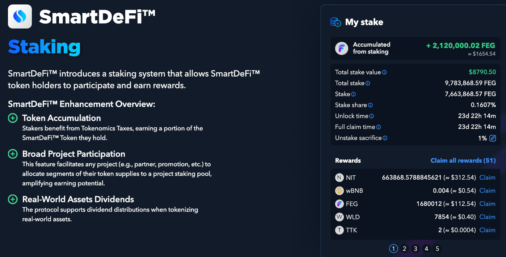

# 🎁 Stakeo

<figure><figcaption></figcaption></figure>

### Recompensas Pasivas para Holders

Los inversores en criptomonedas siempre buscan formas de maximizar sus posesiones y generar recompensas pasivas, y el Protocolo de Stakeo ofrece una oportunidad para hacer precisamente eso. Permite a los holders hacer stake de sus tokens y ganar recompensas del volumen de negociación en intercambios descentralizados como PancakeSwap o Uniswap.

### Funciones del Contrato de Stakeo

<table data-card-size="large" data-column-title-hidden data-view="cards"><thead><tr><th></th><th></th><th data-hidden></th></tr></thead><tbody><tr><td><strong>Personalización del Contrato de Stakeo</strong></td><td>Los propietarios pueden personalizar su stakeo, como las tarifas de depósito y retiro, la asignación de tarifas, el retraso para deshacer el stake y recompensas adicionales.</td><td></td></tr><tr><td><strong>Distribución Automática de Recompensas</strong></td><td>Las recompensas se distribuyen automáticamente y se reinvierten, lo que significa que los usuarios no necesitan reclamar o reinvertir sus ganancias manualmente.</td><td></td></tr><tr><td><strong>Contrato Actualizable</strong></td><td>El contrato de stakeo se actualizará sin que los usuarios y los propietarios de proyectos de SD necesiten realizar alguna acción.</td><td></td></tr><tr><td><strong>Fuentes de Recompensas</strong></td><td>Las recompensas pueden provenir del trading o de propietarios que también pueden inyectar manualmente otras recompensas en monedas <em>(hasta 30 recompensas separadas)</em></td><td></td></tr><tr><td><strong>Token SDSS</strong></td><td>Después de hacer stake, los usuarios reciben SD Stake Shares (SDSS) para representar la propiedad en el pool de stakeo. Por seguridad, SDSS no es transferible</td><td></td></tr><tr><td><strong>Función de Sacrificio</strong></td><td>Los usuarios pueden elegir quemar un porcentaje de sus recompensas de stake cuando deshacen el stake para ayudar a disminuir la oferta circulante de tokens</td><td></td></tr><tr><td>La flexibilidad de no tener un período de bloqueo te permite deshacer el stake cuando quieras, o que el desarrollador de un proyecto elija un período personalizado para su proyecto.</td><td></td><td></td></tr><tr><td>El desarrollador puede decidir si su proyecto tendrá un depósito y retiro o no para ajustar mejor su tokenómica</td><td></td><td></td></tr></tbody></table>

### **Fuente y Distribución de Recompensas de Stakeo**

Las recompensas de stakeo son derivadas de actividades de trading en cadena de proyectos de SmartDeFi; se autocompilan y están disponibles para el usuario en cualquier momento.\
\
Además, el propietario del proyecto puede inyectar manualmente otras recompensas en tokens o monedas para enviar a quienes hacen stake.\
Otras recompensas en tokens se distribuyen en rondas y están sujetas a un cierto umbral de acumulación. Los desarrolladores pueden modificar el umbral de acumulación para las recompensas, lo que puede diferir para cada tipo de recompensa.\
\
Por ejemplo, si 1 wBNB es el umbral, las recompensas se distribuyen cuando el pool de recompensas acumula 1 wBNB.


Deshacer el stake o agregar al propio pool de stakeo dentro de los primeros 30 días del stakeo inicial resultará en una pérdida del 50% de las recompensas.\
\- Las recompensas confiscadas se distribuirán entre otros stakeholders.&#x20;


### **Qué es SDSS**

Después de hacer stake, tus tokens SD serán depositados en el contrato de stakeo y, a cambio, recibirás nuevos tokens llamados SmartDeFi Stake Shares (SDSS). Estas acciones representan tu propiedad en el pool de stakeo. Piensa en SDSS como un recibo del sistema para confirmar que has hecho stake exitosamente. Necesitarás mostrar este recibo al sistema para que te permita deshacer el stake y devolver tus tokens SD.

* SDSS no es una proporción de 1:1
* SDSS se actualiza con cada recompensa de token ganada
* Total de SDSS / Total de SD = Proporción
* No es posible transferir SDSS a otra billetera.

### "Sacrificio" Opcional

La función de sacrificio fue introducida en el nuevo contrato de stakeo a petición de la comunidad para aquellos que deseen ayudar con los esfuerzos de quema y disminuir la oferta circulante de tokens.

Al deshacer el stake, los interesados pueden quemar un porcentaje especificado de sus recompensas de stake, eliminándolos efectivamente de la oferta circulante.

Para activar esto, debes especificar el porcentaje a sacrificar y la cantidad para deshacer el stake.


En cualquier momento antes de deshacer el stake, puedes desactivar el sacrificio configurándolo al 0% en la configuración de Sacrificio.
