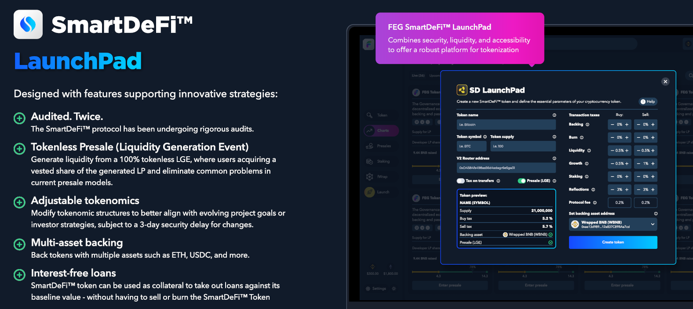

---
layout:
  title:
    visible: true
  description:
    visible: true
  tableOfContents:
    visible: true
  outline:
    visible: true
  pagination:
    visible: true
---

# 🚀 Token Launchpad

<figure><figcaption></figcaption></figure>

### Tu Atajo para la Creación de Tokens, Sin Esfuerzo

쮸lguna vez has soñado con crear tu proyecto cripto pero encuentras las barreras técnicas demasiado altas?\
Entra al SmartDeFi Token Launchpad, tu boleto para lanzar un proyecto Web3 en unos pocos clics sin necesidad de conocimientos de programación.

Con cero costos de desarrollo, cualquiera puede lanzar su idea o proyecto en las cadenas de bloques ETH o BNB con un contrato completamente auditado por [PeckShield](https://peckshield.com/) junto con las siguientes características:

* [Staking](broken-reference) para ingresos pasivos
* [Asset Backing](../smartdefi-protocol/asset-backing.md) para un valor mínimo garantizado
* [Tokenless Presales](presale-launch/) con protección contra rug pull
* Protección contra frontrunning
* [Smart Loans](../smartdefi-protocol/smartlending.md) (0% de interés por 30 días)
* Track App para móvil y escritorio
* Tarifas personalizadas para apoyar tu proyecto
* ... y más


Para interacciones en tiempo real y orientación, únete al Telegram oficial [ t.me/SDlistings](https://t.me/SDlistings)


### La Ventaja de SmartDeFi

SmartDeFi ha estado en desarrollo durante años, y se han invertido miles de horas de trabajo y una cantidad considerable de dinero para hacer realidad este sistema. \
El Launchpad de SmartDeFi ha sido auditado por la principal empresa de seguridad en blockchain [PeckShield](https://peckshield.com/), y ahora puedes obtener todo esto y crear tu propio proyecto utilizando SmartDeFi esencialmente sin costo.\
Para ayudarte a tomar decisiones informadas en tu nueva aventura cripto, hemos recopilado piezas concisas y valiosas de información que puedes leer rápidamente para entender cómo funciona:

<table data-card-size="large" data-column-title-hidden data-view="cards"><thead><tr><th></th><th></th><th data-hidden></th></tr></thead><tbody><tr><td><strong>No necesitas conocimientos de programación</strong></td><td>Puedes crear y lanzar un proyecto sin saber nada de programación, además de incluso opciones como staking, préstamos, lockers, etc.</td><td></td></tr><tr><td><strong>Costos de lanzamiento</strong></td><td>La creación (minting) es GRATIS, sin embargo, las transacciones necesitan tarifas de gas para ejecutarse en las cadenas de bloques. Usa rastreadores de gas para monitorear estos costos <a href="https://bscscan.com/gastracker">BSC</a> / <a href="https://etherscan.io/gastracker">ETH</a></td><td></td></tr><tr><td><strong>Tarifa del protocolo</strong></td><td>Crear tu proyecto es gratis, pero un pequeño impuesto toma un porcentaje de cada transacción de compra y venta. Actualmente, la tarifa está fijada en 0.5%</td><td></td></tr><tr><td><strong>Lista tu proyecto en cualquier lugar</strong></td><td>Siempre que tu proyecto específico cumpla con todos sus estándares para la lista, puedes listar en cualquier CEX, DEX, CoinMarketCap, Coingecko, y más</td><td></td></tr><tr><td><strong>Pareo de liquidez</strong></td><td>Los tokens de SmartDeFi pueden emparejarse con cualquier moneda que desees. Nota que, al lanzamiento, el principal fondo de liquidez se emparejará con BNB o ETH</td><td></td></tr><tr><td><strong>Fondos de liquidez</strong></td><td>Puedes lanzar usando nuestro sistema de preventa y reunir liquidez de tus inversores, o puedes inyectar tu propio dinero en la liquidez</td><td></td></tr><tr><td><strong>Liquidez bloqueada y desbloqueada</strong></td><td>La liquidez de preventa está bloqueada/programada y se libera en lotes, pero la liquidez inyectada manualmente por el propietario está desbloqueada por defecto (puede ser bloqueada)</td><td></td></tr><tr><td><strong>Impuestos personalizados antes y después del lanzamiento</strong></td><td>Control total sobre los impuestos y puedes configurarlos para reunir fondos para marketing, staking, respaldo, liquidez, desarrollo, quema, etc.</td><td></td></tr></tbody></table>


Nota: [CoinW](https://www.coinw.com/), un principal intercambio cripto, ha ofrecido acelerar la lista de cualquier proyecto de SmartDeFi que cumpla con sus criterios y cumpla con los costos de listado. [Contact CoinW](https://www.coinw.com/front/login?forwardUrl=%2Ffront%2Fcoinapply) para más.


### 쯏 ahora qué?

Puedes profundizar más en [SmartDeFi](../smartdefi-protocol/) si lo deseas, o puedes [launch your project](create-a-token.md) ahora mismo!