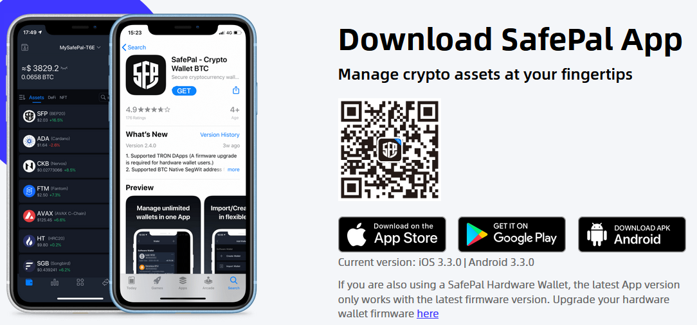

# Crear una billetera criptográfica

### Creando tu Billetera Criptográfica

1. Descarga la [Safepal ](https://www.safepal.com/en/download)app en tu dispositivo; es una de las mejores billeteras.
2. Instala la aplicación de la billetera y sigue la guía oficial para {{link:configurar tu billetera criptográfica}}.


¡Siempre almacena tu frase semilla de manera segura y _nunca_ la compartas con nadie!\
¡Si alguien tiene tu frase semilla, tendrá acceso ilimitado a tu billetera!


### Agregar FEG a tu lista de billetera

1. Abre la aplicación y asegúrate de estar en la pantalla de inicio; dice "billetera" abajo.
2. Busca el menú con tres puntos a la derecha.
3. Haz clic en "Administrar monedas."
4. En el nuevo campo de búsqueda, escribe "FEG" o puedes buscar usando la dirección del contrato:\
   _**0xF3c7CECF8cBC3066F9a87b310cEBE198d00479aC**_
5. Elige qué FEG es adecuado para ti, como el que está en BNB, BASE, o ETH. &#x20;

<figure><figcaption></figcaption></figure>

Si regresas a la pantalla de inicio, verás FEG en tu lista, completo con la cantidad de tokens poseídos, el precio por FEG, el precio total de tus participaciones y otra información.

### Agregar manualmente FEG como un token personalizado

En algunas billeteras, es posible que no puedas localizar FEG dentro de la lista de tokens disponibles en su campo de búsqueda. Puedes agregarlo manualmente como un token personalizado usando la dirección del contrato:\
_**0xF3c7CECF8cBC3066F9a87b310cEBE198d00479aC**_

Dicha billetera puede ser Metamask, pero no te preocupes, es bastante fácil agregar un token personalizado, sigue las instrucciones en la imagen de ejemplo a continuación

<figure><figcaption></figcaption></figure>