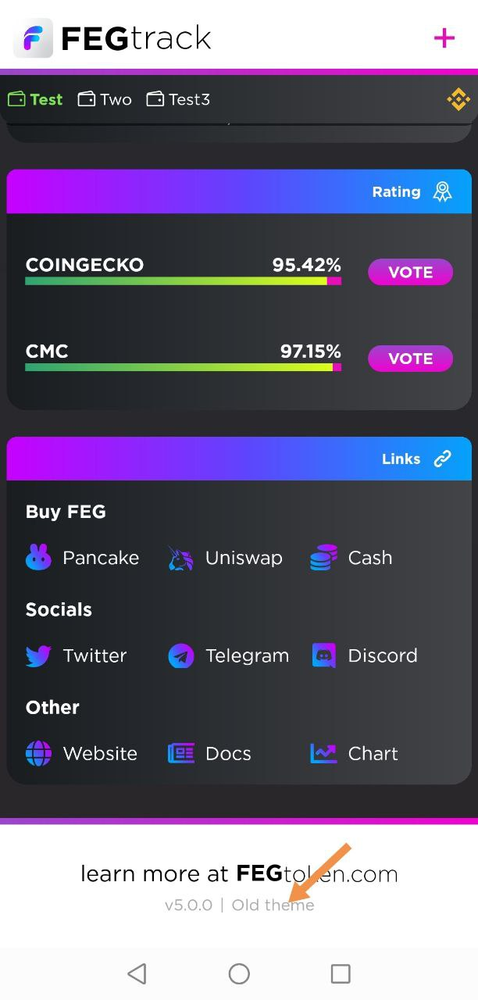

# 📲 Interfaz de FEGtrack


La información en esta página está obsoleta; se proporcionarán actualizaciones


## 1. Cambiar entre los temas Antiguo y Nuevo

<figure><figcaption></figcaption></figure>

Puedes cambiar entre dos temas si haces clic en el tema Antiguo en la parte inferior de la aplicación.

## 2. El menú se movió al fondo

<figure><figcaption></figcaption></figure>

Puedes encontrar enlaces directos al final de la aplicación para votar en Coinmarketcap y Coingeco. Abajo, puedes encontrar enlaces directos para comprar FEGtoken desde plataformas como Uniswap, PancakeSwap o Fiat.\
\
Más abajo en la página, encontrarás enlaces a las diferentes redes sociales mantenidas por el proyecto FEGtoken. Finalmente, encontrarás la versión de la aplicación que tienes instalada.

## 3. Agrega tu(s) billetera(s)

<figure><figcaption></figcaption></figure>

FEGtrack es seguro; NO se conecta a tu billetera; simplemente lee la información de las posesiones desde tu dirección pública de billetera, que es 0x...

Cualquiera en la blockchain puede ver las direcciones públicas de billeteras.\
\
\-Haz clic en el signo + y copia/pega la dirección pública de tu billetera en el campo "dirección de billetera".\
\-Luego, nombra tu billetera.\
\-Este nombre aparecerá en la parte superior de la aplicación una vez guardado.\
\
También puedes agregar la dirección de tu billetera escaneando el código QR dentro.\
\
Una vez hecho esto, haz clic en el botón Guardar Billetera para guardar tu billetera dentro de FEGtrack.

## 4. Cambiar la Red

<figure><figcaption></figcaption></figure>

Cerca de la parte superior de la pantalla, hay un ícono de red que te permite cambiar tu billetera entre las redes de Ethereum y Binance Smart Chain.\
\
Asegúrate de seleccionar la red correcta para los tokens FEG que posees. De lo contrario, tu balance podría indicar cero; no te preocupes si sucede, cambia la red.

## 5. Cambiar entre balances

<figure><figcaption></figcaption></figure>

Al hacer clic repetidamente en el botón "Balance total", se alternará tu panel de control y te mostrará los diferentes balances que tienes.\
\
El texto del botón y las estadísticas del panel cambiarán de la siguiente forma:\
1. Total  /  2. Billetera  /  3. Stake v2  /  4. Stake v1

## 6. Datos de mercado

<figure><figcaption></figcaption></figure>

Desplázate hacia abajo y encontrarás la sección "datos de mercado", donde se te presentarán las estadísticas del capitalización de mercado, volumen, precio, cantidades quemadas y circulación.\
\
Si presionas en las secciones 2, 3, 4 y 6, cambiarán la pantalla para mostrar más datos (por ejemplo, FEG quemado se cambiará a % de FEG en circulación).\
\
¡Pruébalo!

## 7. Transacciones

<figure><figcaption></figcaption></figure>

Más abajo en la aplicación, encontrarás la sección de "transacciones", donde verás una lista en vivo, horizontalmente desplazable, de las transacciones más recientes de compra y venta de FEGtoken.\
\
Si presionas en "Transacciones", cambiará a "Mis transacciones". Puede tardar un poco en cargarse y mostrará tus transacciones con el token FEG. No mostrará transferencias, solo compras y ventas.\

## 8. Cambiar el Tamaño de la Fuente

<figure><figcaption></figcaption></figure>

Si presionas el logotipo de FEGtrack en la parte superior durante unos segundos, la aplicación cambiará a una fuente más grande para aquellos que tienen pantallas más pequeñas. Puedes cambiar al tamaño de fuente predeterminado presionando el logotipo nuevamente.

## 9. Ocultar Balance

<figure><figcaption></figcaption></figure>

Puedes ocultar tu Balance si haces clic en el ícono izquierdo que parece un ojo. Los datos de mercado y transacciones seguirán siendo visibles.