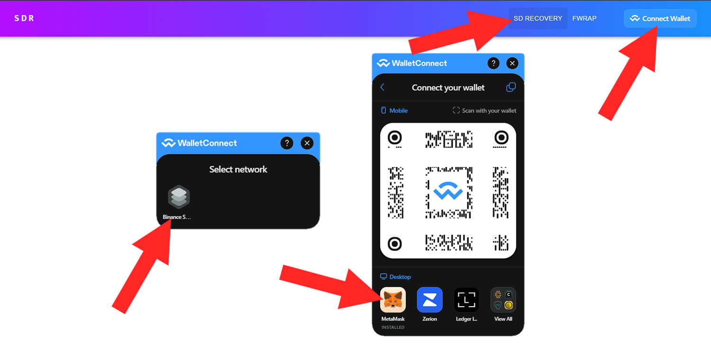

# 👩‍💻 SDR para DEVs


beforePor favor, informa al equipo de FEG que estás listo para recuperar en el chat de Listados SD t.me/SDlistings antes de comenzar.


## Parte 1 - ¿Cómo desbloqueas tu proyecto SD?

### #1 Conecta tu billetera a la herramienta SDR

Asegúrate de estar en la pestaña "SD RECOVERY", que puedes localizar en la parte superior, como se muestra en la imagen de ejemplo.\
\
Luego, haz clic en "Connect Wallet" (Conectar Billetera), selecciona la red en la que estaba tu antiguo proyecto SD (BSC o ETH) y luego procede con los pasos necesarios para completar la conexión de la billetera.

Ten en cuenta que estos pasos pueden variar según el tipo específico de billetera. Es importante destacar que debes realizar esta acción utilizando la billetera del propietario asociada con tu antiguo proyecto SD, no cualquier billetera al azar.

<figure><figcaption></figcaption></figure>

### #2 Desbloquea los fondos

* Asegúrate de estar en la página "SD RECOVERY" en el menú superior.&#x20;
* Selecciona tu antiguo proyecto SD de la lista desplegable de proyectos.
* Haz clic en la pestaña "DEVELOPER" para acceder a las opciones específicas de administración.
* Luego, haz clic en el botón "RESCUE" y confirma la transacción en tu billetera.&#x20;

Ahora has completado el proceso, y los fondos están desbloqueados y listos para ser recuperados por tus antiguos inversores.

<figure><figcaption></figcaption></figure>

## Parte 2 - Más opciones de administración después del desbloqueo&#x20;

Ahora que tu proyecto está desbloqueado y los fondos almacenados en tu LP y respaldo finalmente son accesibles para recuperar, tienes algunas opciones y decisiones a considerar. Puedes:

* Permitir que cada inversor reclame su parte de los fondos almacenados individualmente.
* Realizar un airdrop masivo de los fondos a todos tus antiguos inversores en una transacción, con el requisito de cubrir las tarifas de transacción asociadas.
* Permitir que tus antiguos inversores reinviertan sus fondos en un nuevo proyecto que puedas lanzar.

Examinemos cada opción en detalle.

### #1 Airdrop de fondos a tus antiguos inversores

La herramienta SDR te permite, como propietario del proyecto SD, realizar un airdrop de los fondos desbloqueados directamente a las billeteras de tus antiguos inversores, haciendo que sea conveniente para todos recuperar sus fondos a la vez y asegurando la satisfacción de todos.

Ten en cuenta que serás responsable de cubrir los costes de gas asociados con esta transacción al elegir esta opción. Dada la complejidad de los contratos inteligentes que sustentan este proceso, las tarifas de gas podrían ser sustanciales, requiriendo un pago significativo a la cadena de bloques.

Si deseas proceder con este método, debes compilar una lista de todas las direcciones de billetera pertenecientes a tus tenedores anteriores, con cada dirección separada por una coma (ejemplo: dirección1, dirección2, dirección3). Después, haz clic en el botón "AIRDROP" y confirma la transacción.

Tus tenedores anteriores ahora recibirán su parte exacta de los fBNB/fETH almacenados en LP/respaldo directamente en sus billeteras, con deducciones hechas para los gastos requeridos por los contratos inteligentes para su ejecución.

<figure><figcaption></figcaption></figure>

### #2 Permitir que cada inversor reclame su parte individualmente

Esta opción es bastante autoexplicativa. Una vez que desbloqueas los fondos, ya no se requiere que tomes más acciones. Los fondos ahora están accesibles para que tus inversores los reclamen de forma independiente, y la guía para que lo hagan se puede encontrar en la página "{{link:SDR para Inversores}}".

### #3 Reclamar fondos reinvertidos para iniciar un nuevo proyecto SD

Si logras persuadir a tus antiguos inversores para que apoyen tu nuevo proyecto SD y emprendan esta nueva aventura contigo, no podrán reclamar su parte de los fBNB/fETH de tu antiguo proyecto SD desbloqueado. En su lugar, pueden reinvertir sus fondos en tu nuevo proyecto.

Una vez que los usuarios eligen la opción de "reinvestir", los creadores del proyecto pueden ver la cantidad de fBNB/fETH que han enviado en el campo "Claimable reinvested allocation". Esto representa los fondos disponibles para que los retires a tu billetera. Por favor, ejerce diligencia en el uso de estos fondos, ya que son confiados a ti por personas que confían en tu compromiso.

Cuando creas que se ha acumulado una cantidad suficiente de fondos de tus inversores anteriores, puedes hacer clic en el botón "CLAIM" para transferir estos fondos desde el LP/respaldo de tu antiguo token a tu billetera. Esta opción se puede usar múltiples veces. Por ejemplo, puedes reclamar 10 fBNB ahora, y a medida que más inversores anteriores reinviertan sus fondos en las próximas semanas, podrás reclamar la cantidad recién recaudada también, y así sucesivamente.

En el futuro, después de inyectar estos fondos reinvertidos en tu nuevo proyecto SD y lanzarlo, necesitarás idear un método adecuado para devolver estos fondos a tus inversores, generalmente a través de una distribución de tokens como un airdrop u otro enfoque elegido colectivamente por ti, tus desarrolladores y tu comunidad. Mucha suerte con tus esfuerzos.

<figure><figcaption></figcaption></figure>