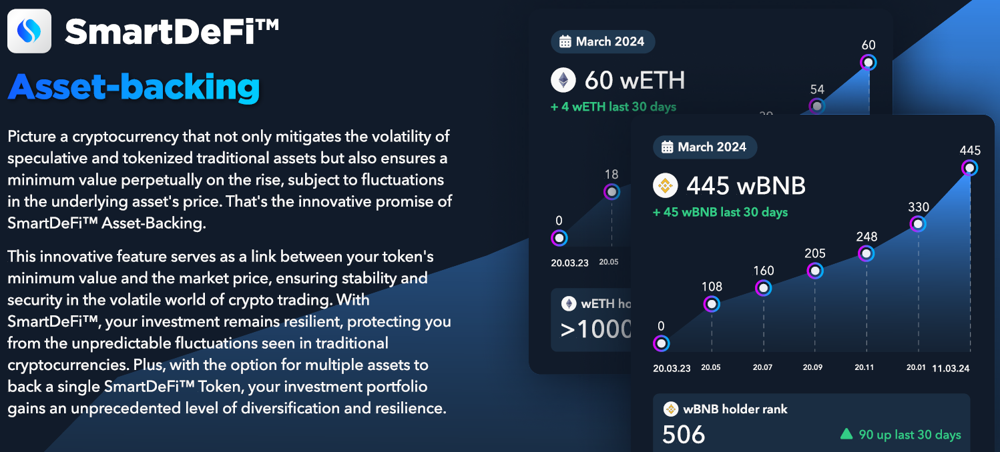

# 💵 Respaldo de Activos

<figure><figcaption></figcaption></figure>

### SmartDeFi: Tokens Estables para un Mercado Volátil

Imagina una **criptomoneda** no solo afectada por el hype y las caídas, sino que también tiene una **red de seguridad incorporada**. Eso es lo que ofrece SmartDeFi con el **respaldo de activos**.

Aquí tienes lo esencial:

* **Cada transacción** con un token de SmartDeFi contribuye a un **fondo de reserva** llamado respaldo de activos. Este fondo contiene activos reales como BNB, USDT, o cualquier otra moneda que el proyecto eligió al lanzarse.
* Esta reserva **crece continuamente**, creando un **precio mínimo** para el token. El valor base del token no bajará de este mínimo incluso si el mercado colapsa.
* Esta **estabilidad** te protege de **estafas** y **esquemas de pump-and-dump**. Finalmente, puedes mantener y comerciar tokens que tienen valor real, no solo hype momentáneo.
* Cuando las personas **queman** sus tokens de SmartDeFi (los sacan de circulación), los **tokens restantes se vuelven más valiosos** aún más rápido en el futuro. Quemar los tokens crea un **efecto deflacionario**.

**En resumen, SmartDeFi ofrece:**

* **Estabilidad:** Tu inversión está protegida de las caídas del mercado.
* **Seguridad:** Estás a salvo de estafas y manipulación.
* **Crecimiento:** El valor del token tiene el potencial de aumentar con el tiempo.

**Piensa en ello así:**

* **Criptomoneda regular:** Como una montaña rusa, también puede llegar a cero además de subir y bajar.
* **SmartDeFi: Como un barco robusto, resiste las tormentas y asegura que tu token nunca valdrá cero.**

**¿Listo para invertir en un futuro más estable? Considera SmartDeFi.**