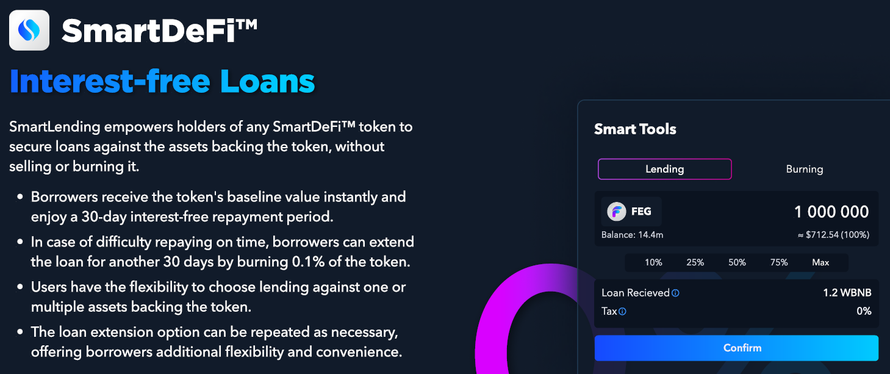

# 🏦 SmartLending

<figure><figcaption></figcaption></figure>

A través de _SmartLending_, cualquier token SmartDeFi puede usarse como garantía para obtener préstamos contra su valor base, sin tener que vender o quemar el Token.

Al tomar el préstamo, el prestatario recibe instantáneamente el valor base por el Token colateralizado. El prestatario tiene **30 días** para devolver el préstamo _sin interés_.\
\
Si el préstamo no puede ser devuelto a tiempo, el usuario puede extender el periodo de préstamo por otros 30 días quemando el 0,1% de su garantía y puede extenderlo una y otra vez.


Nota: Extender el SmartLoan antes de que venza el término de 30 días es esencial. De lo contrario, el préstamo entra en incumplimiento y la garantía se quema (se pierde).



Debido a que los tokens colateralizados se mantienen dentro del contrato inteligente y se consideran parte del suministro circulante, continúan acumulando respaldo de activo tal como lo harían en la billetera del inversor. La continua acumulación de respaldo de activos permite que SmartLending esté _libre de intereses._&#x20;


### ¿Qué significa esto?

SmartLending significa que ahora puedes acceder al valor base de tu token SmartDeFi sin venderlo. Esto es perfecto para emergencias o para aprovechar el lanzamiento de un nuevo Token sin vender tus activos.\
\
Esto significa que tienes libertad y puedes tratar tu valor base como un activo bancarizado.

### ¿Qué tan seguro es?

SmartLend no requiere oráculos, ya que el precio proviene directamente del valor base extraído del contrato inteligente. Además, como SmartLend no requiere terceros, no hay espacio para manipulación externa o explotación del código.


**SmartLend es el primer protocolo de préstamos en el que los fondos y los datos para los cálculos de ratio se alojan en el mismo lugar, convirtiéndolo en el protocolo más seguro jamás creado.**


### ¿Hay un impuesto por prestar un Token SmartDeFi?

No, pero si un Token SmartDeFi ™ tiene un impuesto por reflejo, al prestar contra él, SE descontará ese impuesto por reflejo.

### ¿Por qué el Token no aparece en la billetera después de tomar un préstamo?

SmartLend retiene el Token del usuario en el Contrato Inteligente como garantía mientras presta el tipo de token de respaldo de activo al valor base del Token. Por ejemplo, si el Token está respaldado por un activo en wBNB, el préstamo se otorgará en wBNB.

### ¿Los Tokens dentro de SmartLend reciben reflejos (RFI)?

**No**, no lo hacen. Una vez que un Token se usa como garantía para un préstamo SmartLend, los tokens SD no reciben reflejos mientras están retenidos dentro del Contrato Inteligente.

### ¿Puedo devolver en partes?

Puedes devolver en tantas partes como desees, y también recibirás tu token SD en partes.\
Una vez que un usuario devuelve la última parte y, por lo tanto, reembolsa su préstamo por completo, todos los Tokens SD restantes se devuelven al usuario en su billetera, y los tokens SD comenzarán nuevamente a recibir reflejos si el Token es reflectivo (RFI).