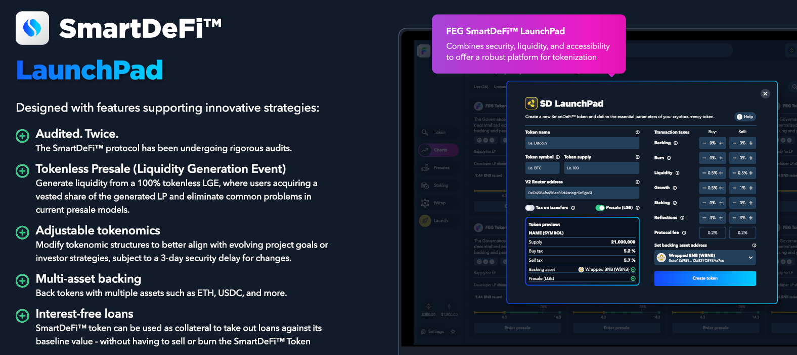

---
layout:
  title:
    visible: true
  description:
    visible: true
  tableOfContents:
    visible: true
  outline:
    visible: true
  pagination:
    visible: true
---

# 🚀 Plataforma de Lanzamiento de Tokens

<figure><figcaption></figcaption></figure>

### Tu Atajo para la Creación de Tokens, Sin Esfuerzo

¿Alguna vez has soñado con crear tu proyecto de criptomonedas pero encontraste las barreras técnicas demasiado altas?\
Entra en la Plataforma de Lanzamiento de Tokens de SmartDeFi, tu boleto para lanzar un proyecto Web3 en unos pocos clics sin necesidad de conocimientos de programación.&#x20;

Sin costos de desarrollo, cualquiera puede lanzar su idea o proyecto en las blockchains de ETH o BNB con un contrato totalmente auditado por [PeckShield](https://peckshield.com/) junto con las siguientes características:

* [Staking](broken-reference) para ingresos pasivos
* {{link:Respaldo de Activos}} para un valor mínimo garantizado
* {{link:Preventas sin Tokens}} con protección contra estafas
* Protección contra frontrunning
* {{link:Préstamos Inteligentes}} (0% de interés por 30 días)
* Aplicación de Seguimiento para móvil y escritorio
* Tarifas personalizadas para apoyar tu proyecto
* &#x20;... y más


Para interacciones en tiempo real y orientación, únete al Telegram oficial [ t.me/SDlistings](https://t.me/SDlistings)


### La Ventaja de SmartDeFi

SmartDeFi ha estado en desarrollo durante años, y se han invertido miles de horas de trabajo para crear esta avanzada plataforma de lanzamiento, junto con una considerable cantidad de dinero invertido en hacer realidad este sistema.\
La plataforma de lanzamiento SmartDeFi ha sido ampliamente auditada por la empresa líder en seguridad blockchain [PeckShield](https://peckshield.com/) y ahora puedes obtener todo esto y crear tu propio proyecto usando SmartDeFi esencialmente de forma gratuita.\
Para ayudarte a tomar decisiones informadas en tu nuevo viaje criptográfico, hemos recopilado piezas de información concisas y valiosas que puedes leer rápidamente para tener una idea de cómo funciona:

<table data-card-size="large" data-column-title-hidden data-view="cards"><thead><tr><th></th><th></th><th data-hidden></th></tr></thead><tbody><tr><td><strong>Cero conocimiento de programación necesario</strong></td><td>Puedes crear y lanzar un proyecto sin saber nada sobre programación, además de opciones como staking, préstamos, lockers, etc.</td><td></td></tr><tr><td><strong>Costos de lanzamiento</strong></td><td>La acuñación es GRATUITA, sin embargo, las transacciones necesitan tarifas de gas para ejecutarse en blockchains. Usa rastreadores de gas para monitorear estos costos <a href="https://bscscan.com/gastracker">BSC</a> / <a href="https://etherscan.io/gastracker">ETH</a></td><td></td></tr><tr><td><strong>Tarifa del protocolo</strong></td><td>Crear tu proyecto es gratis, pero un pequeño impuesto toma un porcentaje de cada transacción de compra y venta. Actualmente, la tarifa está establecida en 0.5%</td><td></td></tr><tr><td><strong>Lista tu proyecto en cualquier lugar</strong></td><td>Siempre que tu proyecto específico cumpla con todos los estándares para su listado, puedes listar en cualquier CEX, DEX, CoinMarketCap, Coingecko, etc.</td><td></td></tr><tr><td><strong>Emparejamiento de Liquidez</strong></td><td>Los tokens de SmartDeFi pueden emparejarse con CUALQUIER moneda que desees. Nota que, al lanzamiento, el principal pool de liquidez se emparejará con BNB o ETH</td><td></td></tr><tr><td><strong>Fondos de liquidez</strong></td><td>Puedes lanzar usando nuestro sistema de preventa y reunir liquidez de tus inversionistas, o puedes inyectar tu propio dinero en liquidez</td><td></td></tr><tr><td><strong>Liquidez bloqueada y desbloqueada</strong></td><td>La liquidez de preventa está bloqueada/vestida y se libera en lotes, pero la liquidez inyectada manualmente por el propietario está desbloqueada por defecto (puede ser bloqueada)</td><td></td></tr><tr><td><strong>Impuestos personalizados antes y después del lanzamiento</strong></td><td>Control total sobre impuestos y se pueden establecer para reunir fondos para marketing, staking, respaldo, liquidez, desarrollo, quema, etc.</td><td></td></tr></tbody></table>


Nota: [CoinW](https://www.coinw.com/), un importante intercambio de criptomonedas, ha ofrecido acelerar el listado de cualquier proyecto SmartDeFi que califique para sus criterios y cumpla con los costos de listado. {{link:Contacta a CoinW}} para más.


### ¿Y ahora qué?

Puedes profundizar en [SmartDeFi](../smartdefi-protocol/) si lo deseas, o puedes {{link:lanzar tu proyecto}} ahora mismo.