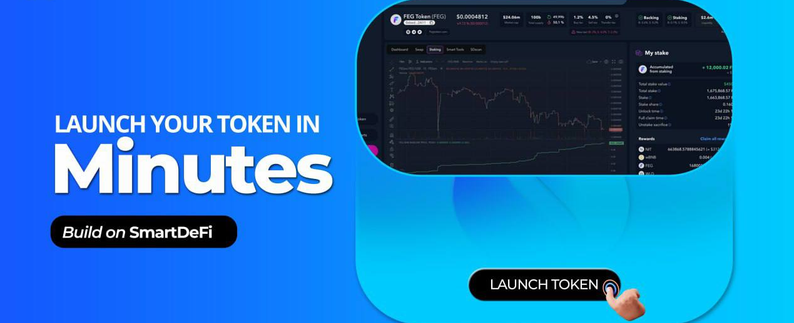

# 〽️ Crear un Token

### SmartDeFi Potencia Tu Visión

Para los dueños de proyectos que navegan por las complejidades de lanzar un proyecto de criptomonedas, el SmartDeFi Launchpad de FEG emerge como una plataforma innovadora diseñada para empoderar a los dueños de proyectos y llevar sus visiones criptográficas a la vida sin necesidad de conocimientos de programación.

SmartDeFi Launchpad ofrece una caja de herramientas completa para crear, gestionar y evolucionar tu proyecto cripto. Con SDL, puedes convertir tu visión en una exitosa iniciativa cripto.\
Crear un nuevo proyecto cripto SmartDeFi se puede hacer en unos pocos clics, y aquí te mostramos cómo hacerlo.

<figure><figcaption></figcaption></figure>

### Crear Tu Token con Facilidad

Crear tu token se convierte en un proceso sencillo con una simple visita a [SmartDeFi.com](https://smartdefi.com)\
\
El botón "Launch SD" en el menú de la izquierda desbloquea la ventana "Create SmartDeFi Token", donde puedes acuñar y personalizar tu token, todo en una sola ventana sencilla.&#x20;

<figure><figcaption></figcaption></figure>

Personaliza tu proyecto con varios parámetros, ofreciendo una flexibilidad inigualable para tus necesidades únicas.\
El menú de creación de tokens te ofrece control sobre opciones como:\
\- **Nombre del token**, por ejemplo: Bitcoin (solo usar letras/números).\
\- **Símbolo del token**, por ejemplo: BTC.\
\- **Suministro** de tu token, hasta un máximo de 5 quintillones.\
\- El impuesto de **respaldar** inyectará fondos en tu fondo de respaldo de activos con cada operación.\
\- **Activo de respaldo:** Dirección de la moneda/token deseada para respaldo; por defecto, se introducirá **wBNB/wETH**.


**Nota: El protocolo SmartDeFi funciona mejor con tipos de decimales 1e18 para los activos usados como respaldo, pero puedes elegir activos con menos decimales.**&#x20;

**Si planeas lanzar LGE, la cantidad de decimales en los activos elegidos para respaldo determinará si los participantes de LGE reciben una parte del respaldo de activos durante la Reclamación de Participaciones o no.**&#x20;

**Es probable que los activos del respaldo de activos con menos de 1e15 decimales no se distribuyan durante los eventos de Reclamación de Participaciones de LGE (los participantes de LGE aún recibirán las participaciones de liquidez según lo previsto). Los tokens con respaldo de activos que tengan menos de 15 decimales aún se podrán utilizar para trading, para SmartLoans, Quemar por Respaldo u otra funcionalidad de SmartDeFi. Solo el aspecto de LGE se verá afectado por la elección de los activos para respaldo con menos de 15 decimales.**


\
\- **Impuesto de quema:** si deseas quemar tokens automáticamente durante el trading\
\- Impuesto de **liquidez**: esto inyectará BNB/ETH y tu token SD en tu fondo de liquidez, ayudando así a fortalecer la profundidad de tu liquidez.\
\- Impuesto de **crecimiento**: Los tokens SD se enviarán a la billetera del propietario de SD con cada operación, y los equipos pueden usar estos fondos para marketing, pago de equipos, listados en CEX, y lo que necesiten para administrar el proyecto.\
\- Impuesto de **staking**: envía recompensas de tokens SD a aquellos que usan la plataforma de staking SmartDeFi.\
\- Impuesto de **reflejos**: para recompensar a los tenedores sin fricción con pequeñas cantidades de tokens SD en cada operación.\
\- **Diferentes impuestos:** Los creadores del proyecto pueden establecer diferentes niveles impositivos para compras y ventas.\
\-- Nota: "**Impuesto en transferencias**" utilizará por defecto las mismas configuraciones de impuestos de las compras.\
\-- **Límites**: Todos los impuestos combinados no pueden ser más del 50% para comprar y 50% para vender.


**La Tarifa del Protocolo** es un pequeño impuesto del 0.5% que el equipo DEV utilizará para continuar construyendo, actualizando y haciendo crecer el ecosistema y recompensando a los usuarios. \
Así que si estableces tus impuestos personalizados al 5%, el total será del 5.5% con la tarifa del protocolo.

**Bajo ciertas condiciones, la tarifa del protocolo del 0.5% puede reducirse hasta el 0.1% dependiendo del tamaño de la liquidez o del respaldo de activos. Ver más detalles** {{link:**aquí**}}


Una vez satisfecho con las configuraciones elegidas, un simple clic en el botón "Crear Token" inicia el proceso. La aprobación desde la aplicación de la billetera y cubrir las tarifas de gas blockchain de la transacción completa el proceso de creación del token.

Felicidades, ahora eres el feliz dueño de un proyecto cripto, y en este punto, notarás que has recibido todo el suministro de este nuevo token en tu billetera.

### Opciones para Liquidez: Tu Elección, Tu Lanzamiento

El siguiente paso es lanzar tu proyecto públicamente, y para hacerlo, SmartDeFi Launchpad ofrece a los propietarios de proyectos la flexibilidad de elegir entre una {{link:recaudación de fondos LEAP pública}} para reunir liquidez o lanzar primero y manualmente {{link:agregar liquidez más tarde}} desde la billetera del propietario.

Si no estás utilizando un lanzamiento de preventa, agregar manualmente la liquidez es esencial para que tu token se negocie públicamente en PancakeSwap o Uniswap.

### Menú Posterior a la Creación

<figure><figcaption></figcaption></figure>

Tras la creación del token, los dueños del proyecto tienen acceso a un panel de control completo equipado con varias configuraciones relacionadas con la liquidez del token, lanzamiento de preventa, agregar respaldo de activos, habilitar staking, editar impuestos, agregar logotipo del proyecto, información del token, enlaces sociales, y más.&#x20;

### • **Agregar Logo y Descripción**



### • **Agregar Respaldo de Activos**

Si tienes fondos disponibles en tu billetera, puedes inyectar fondos manualmente en el fondo de respaldo de activos para tu proyecto en cualquier momento.\
Si no, déjalo como está, y el fondo se llenará lentamente de forma automática debido al impuesto de respaldo que configuraste anteriormente en la ventana de creación del token.

### • **Editar Impuestos**&#x20;

Si olvidaste crear un impuesto de respaldo de activos antes, durante la creación del token, no te preocupes, puedes editar cualquiera de los impuestos de tu proyecto incluso después de la creación del token, según tus necesidades, usando el botón "Editar impuestos". \
\- Nota: No puedes cambiar los impuestos al momento; de un minuto a otro, hay un retraso diseñado para proteger a los inversores. Puedes cambiar los impuestos cuantas veces desees en los próximos años, pero no puedes activar estos impuestos recién editados durante los próximos tres días después de haber sugerido los nuevos impuestos. Regresa a este menú después de que el temporizador se acabe y activa los nuevos impuestos. De lo contrario, tu proyecto seguirá usando los impuestos anteriores.\
\
Usar esta opción de "editar impuestos" mostrará una advertencia pública en la página de tu token en FEGex para notificar a los inversores de tu acción para cambiar la tokenómica del proyecto.\
\
También tendrás acceso a una herramienta avanzada llamada [SDscan](sdscan-tool/), que te proporciona un control sin precedentes sobre el funcionamiento interno de tu nuevo proyecto de token, permitiéndote leer la información y modificar tu token (dentro de ciertos límites) en el smart contract del token.