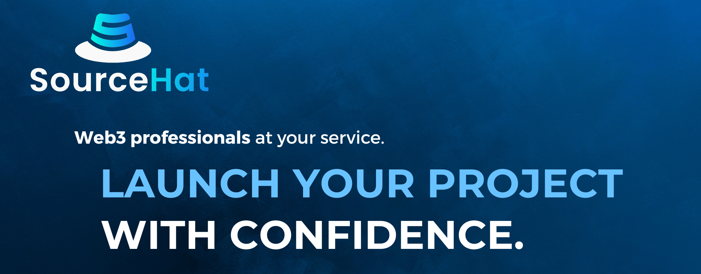

# 🔐 Auditorías de Seguridad

### Búsqueda de seguridad

A la luz del creciente número de hacks y exploits en el espacio de las criptomonedas, el equipo de FEG ha iniciado una rigurosa búsqueda de una firma de seguridad blockchain de primer nivel capaz de realizar auditorías exhaustivas de nuestros contratos inteligentes avanzados.

### Seguridad en el horizonte

<figure><figcaption></figcaption></figure>

Después de una larga y cuidadosa consideración, hemos seleccionado [PeckShield](https://peckshield.com/) como nuestro principal socio de confianza para auditorías de seguridad. La reputación de [PeckShield](https://peckshield.com/) por su excelencia y experiencia en la auditoría de contratos inteligentes sofisticados los hace ideales para proteger nuestro proyecto y brindar a nuestros inversores la seguridad que merecen.

<figure><figcaption></figcaption></figure>

¿Quieres saber qué es mejor que una gran empresa de seguridad blockchain de terceros? ¡Dos empresas! Como tal, el equipo ha seleccionado SourceHat como nuestro segundo socio profesional de Web3 para realizar auditorías de seguridad exhaustivas en todos los contratos relacionados con SmartDeFi, con el fin de garantizar que todo sea lo mejor posible, todo en interés de la seguridad.&#x20;


Los informes de auditoría experimentarán actualizaciones a medida que se realicen mejoras futuras en los contratos existentes.


## Lista de auditorías de seguridad

### 2023-02-10 Informe de Auditoría FEG SmartDeFi v1.1 (PeckShield)



### 2023-03-06 Informe de Auditoría FEG Migrator v1.0 (PeckShield)



### 2023-07-10 Informe de Auditoría FEG Staking v1.0 (PeckShield)



### 2024-05-14 Informe de Auditoría FEG Migrator 2 v1.0 (PeckShield)



### 2024-05-14 Informe de Auditoría FEG Bridge v1.0 (PeckShield)



### 2024-05-14 Informe de Auditoría FEG Fee Converter v1.0 (PeckShield)



### 2024-05-15 Nuevo Informe de Auditoría FEG SmartDeFi v1.0 (PeckShield)



### 2024-05-29 Evaluación de la plataforma SmartDeFi (SourceHat)

